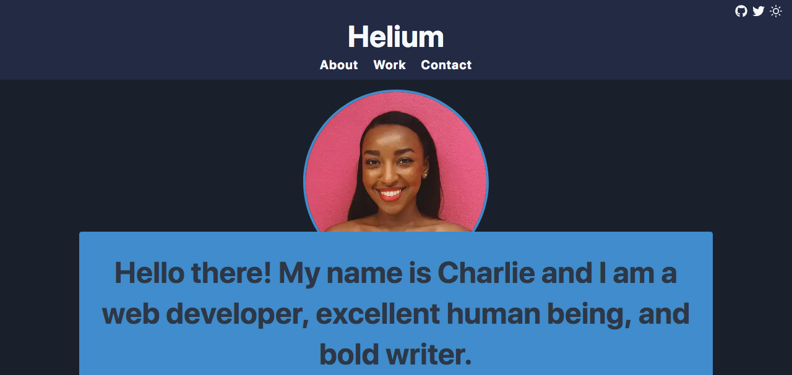

I am a big fan of using [Theme UI](https://theme-ui.com/) to style Gatsby projects. For me one of the standout features is the less well known - but very powerful - API called [variants](https://theme-ui.com/guides/variants/). Variants allow you, as a theme developer, to enable a happy path for users to customize their visual design without having to shadow entire components.

If you just want to modify the CSS styles of a theme then variants are your friend!

However, there are two main challenges with variants. The first difficulty is that they need to be proactively built into components as you create a theme. Not every component needs a variant but when used purposefully it is like you are putting tiny signposts in the theme that say "edit here!". The variants sit unused until they are referenced in the theme specification file when customizing a theme.

> Whew - that is a lot of "themes"! The _theme specification file_ is a javascript file used by Theme UI to define your visual styles; colors, fonts, spacings, etc. A _theme_ refers to a larger collection of components and elements that make up a complete website.

The second hurdle with variants is that they need to be well documented. There is not currently a way to surface which components have variants and which ones do not. Without proper documentation you are forced to manually comb through code to see which components have a variant and which ones do not.

Here is a simple example of the variant API in action.

In the component you define the variant:

```jsx
/** @jsx jsx */
import { jsx, Styled } from "theme-ui"

const SiteTitle = () => {
  return (
    <Styled.h1
      sx={{
        color: "purple",
        fontSize: "5rem",
        variant: "variants.siteTitle",
      }}
    >
      My Site's Title
    </Styled.h1>
  )
}

export default SiteTitle
```

In the theme specification file you reference the variant to modify the CSS:

```js
export default {
  variants: {
    siteTitle: {
      color: "yellow",
      fontFamily: "serif",
    },
  },
}
```

And voila - now your site title is yellow and a serif font!

The way I have used variants in [gatsby-theme-catalyst-helium](https://www.gatsbycatalyst.com/docs/gatsby-theme-catalyst-helium) is a real world example of these ideas. When building this theme I designed for variants from the beginning. This allowed me to create a theme with minimal styles and then implement branding, tone and colors in the finished site. The result is that sites based on this theme share structural similarities but can have quite different visual appearances.

Here is what `gatsby-theme-catalyst-helium` looks like with minimal styles:



Here is what `gatsby-theme-catalyst-helium` looks like with variants:


Pretty amazing right!

The [full theme specification file](https://github.com/ehowey/gatsby-theme-catalyst/blob/master/starters/gatsby-starter-catalyst-helium/src/gatsby-plugin-theme-ui/index.js) is available on GitHub to review, it is too long to post here. So when you are building your next theme - don't forget to add those variants. Make it easy for other developers to personalize the theme and they will thank you!

Happy coding!
