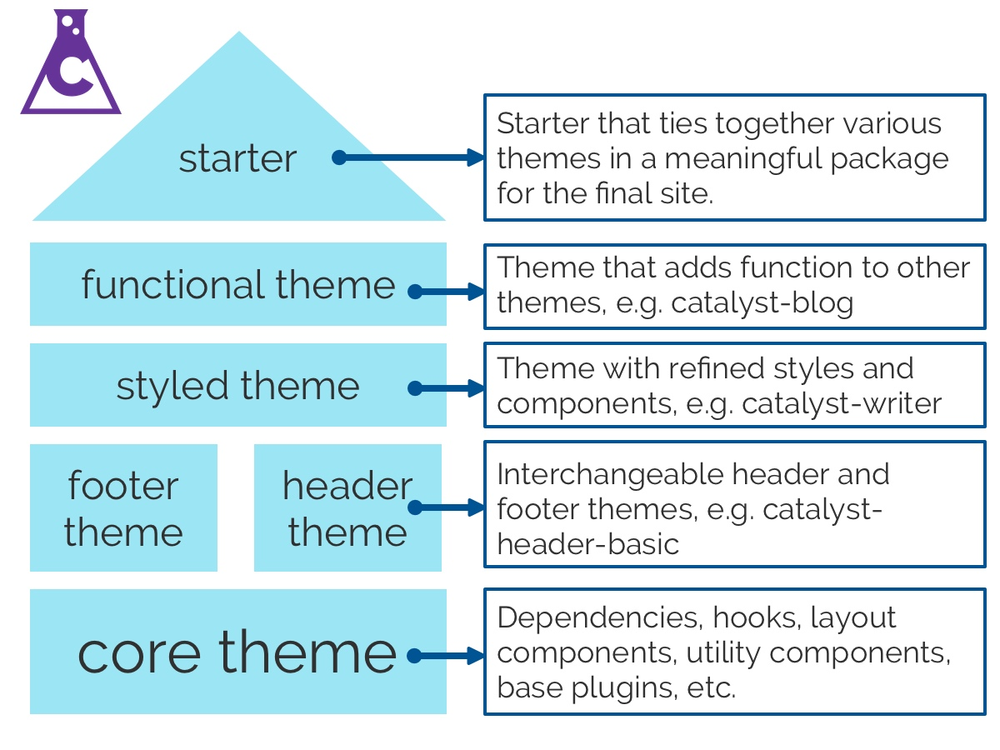

[Gatsby Theme Catalyst](https://github.com/ehowey/gatsby-theme-catalyst) is my opinionated view of a modern tech stack relying on a combination of [Gatsby](https://www.gatsbyjs.org/), [MDX](https://mdxjs.com/), [Theme-UI](https://theme-ui.com/), and [SANITY.io](https://theme-ui.com/). I built this series of themes to accelerate the development process and have a modular approach for my freelance work. As a side benefit building the themes has been a great way to learn an exciting set of new technologies including React and GraphQL. The themes are all open source, managed in a monorepo, and I have done my best to provide [robust documentation on github.](https://github.com/ehowey/gatsby-theme-catalyst) Contributions are welcome and encouraged. If you have a suggestion or run into a problem please submit an issue on Github.

## How it works?

Imagine Lego. A set of interlocking blocks that connect together to create a final form.

It all starts with a solid core theme. This acts as a base layer for other themes providing package dependencies, hooks, SEO, initial plugin configurations and more.

You then pick additional themes as necessary such as a header theme and footer theme to match your site design. This provides a basic, unstyled, starting point for building a custom site. Change the colours, add branding, add content, shadow components and you are ready to go. For an example of this in action see [gatsby-starter-catalyst-basic](https://gatsby-starter-catalyst-basic.netlify.com/) and this site which is a styled version of the starter.



There are also more “complete” themes with CMS integration, custom components, and styling. These themes require less customization before being ready to go - but are less flexible because of how tightly integrated they are. For an example of this in action you can see [gatsby-starter-catalyst-writer](https://gatsby-starter-catalyst-writer.netlify.com/) and [briannasharpe.com](https://www.briannasharpe.com/), which is a customized version of the starter.

Currently there a limited number of themes and starters to work with but I will be adding more over time and focusing on enhancements now that the core API and base themes are stable.

## Catalyzing start

This will walk you through a setup for a basic blog using Gatsby Theme Catalyst. I assume you have a development environment already setup for Gatsby and some familiarity with Gatsby in general. If you are completely new to Gatsby I would suggest starting with [the official tutorial first.](https://www.gatsbyjs.org/tutorial/)

### Use gatsby-starter-catalyst-blog for an initial setup

This starter implements four themes, `gatsby-starter-catalyst-core`, `gatsby-starter-catalyst-header-basic`, `gatsby-starter-catalyst-footer-basic`, and `gatsby-starter-catalyst-blog`. It is purposefully unstyled to give a clean starting point for building a custom Gatsby based blog.

```
# create a new Gatsby site using the catalyst basic starter site
gatsby new catalyst-blog https://github.com/ehowey/gatsby-starter-catalyst-blog
# change to your new directory
cd catalyst-blog
# run gatsby develop for the first time
gatsby develop

```

You should now have something that looks like this:


### Customize your siteMetadata, socialLinks, logo, theme colors and more

You can now configure a whole host of options via `gatsby-config.js` including your site title, social links, menu links, etc. There is documentation about the [options for this on Github](https://github.com/ehowey/gatsby-theme-catalyst#modifying-gatsby-configjs).

You can change colors, fonts, spacings and more via `src/gatsby-theme-catalyst-core/theme.js`, again there is more detail on how to do this with in the github repo and via [Theme-UI's excellent docs](https://theme-ui.com/getting-started).

The logo can be changed by replacing the `catalyst-site-logo.png` file in `content/assets`. This can be a .jpg file as well but the name needs to remain catalyst-site-logo. You could also shadow the logo component for more granular control but that would be a more advanced solution.

### Add some of your own content

Create a new file called `new-post.mdx` in `content/posts`.

Add the following information to the file and save it.

```
---
title: My new post
author: My name
authorLink: https://twitter.com
date: 2020-01-05
featuredImage: ../assets/featured1.jpg
---

Here is my awesome new post
```

Congratulations you have just done your first blog post! You can find information on [additional supported frontmatter fields](https://github.com/ehowey/gatsby-theme-catalyst/tree/master/themes/gatsby-theme-catalyst-blog#frontmatter-fields) in the docs.

### 4. Deploying and beyond

You can deploy this project however you want but I would recommend either [Gatsby Cloud](https://www.gatsbyjs.com/cloud/) or [Netlify](https://www.gatsbyjs.org/docs/deploying-to-netlify/) because of how straightforward they can be.

If you build something with Gatsby Theme Catalyst I would love to see what you create, please send me a note on [Twitter](https://twitter.com/erchwy) or an [email](mailto:eric@erichowey.dev). Get building and have fun!
