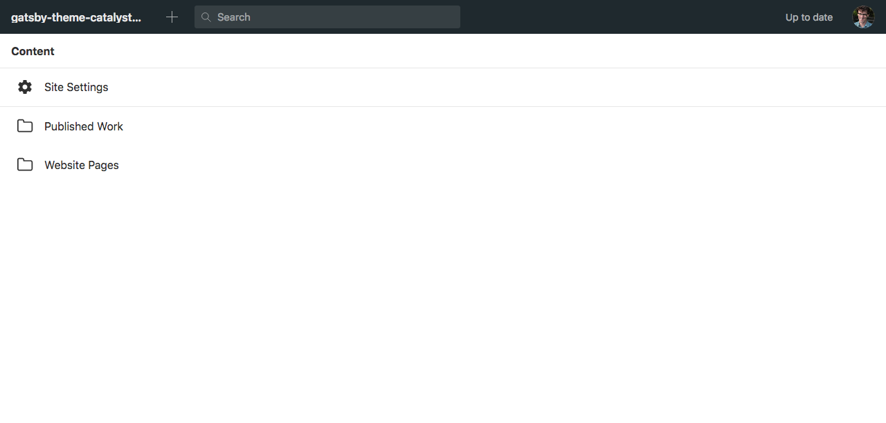
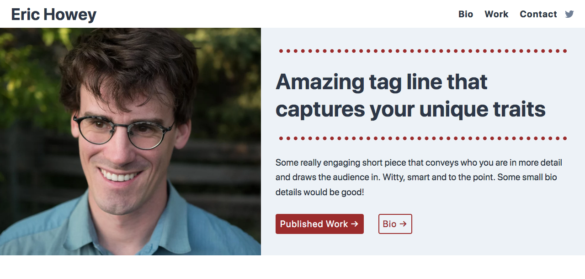

> This theme has been depreciated, instead use [gatsby-theme-catalyst-hydrogen](https://www.gatsbycatalyst.com/docs/tutorials/building-a-website-for-a-freelance-writer-using-gatsby-theme-catalyst-hydrogen), which is an updated version of this theme with an improved API. There is a [complete tutorial](https://www.gatsbycatalyst.com/docs/tutorials/building-a-website-for-a-freelance-writer-using-gatsby-theme-catalyst-hydrogen) for this updated theme you can follow.

This Gatsby theme is for freelance writers and journalists who want a fast, easy to maintain, and elegant portfolio. The backend data is provided by [SANITY.io](https://www.sanity.io/) and the front end is based on [Catalyst themes](https://github.com/ehowey/gatsby-theme-catalyst). This tutorial assumes basic familiarity with web development and Gatsby. If you are new to either of these topics I would recommend starting with [Gatsby's excellent tutorial series](https://www.gatsbyjs.org/tutorial/) and then coming back here. There is also a [helpful blog post](https://www.sanity.io/blog/how-to-quickly-set-up-a-gatsby-js-jamstack-website-with-a-headless-cms) that goes over some of these same ideas in a more general way.

Here are two demos of the completed theme in action:

- [https://www.briannasharpe.com/](https://www.briannasharpe.com/) (customized)
- [https://gatsby-starter-catalyst-writer.netlify.com/](https://gatsby-starter-catalyst-writer.netlify.com/) (raw starter)

## Install the theme using a starter

```sh
# create a new Gatsby site using the catalyst writer starter site
gatsby new catalyst-writer https://github.com/ehowey/gatsby-starter-catalyst-writer
```

## Install SANITY.io

```sh
npm install -g @sanity/cli
```

## Initialize SANITY.io and setup your content studio

```sh
# Move to the starter directory
cd catalyst-writer
# Move to the content studio directory
cd sanity-studio
# Initialize SANITY
sanity init
# Answer YES to reconfiguring the studio
? The current folder contains a configured Sanity studio. Would you like to reconfigure it? Y
# Register or login to SANITY following their prompts
Good stuff, you are now authenticated. You will need a project to keep your
datasets and collaborators safe and snug.
# Create a new SANITY project
? Select project to use (Use arrow keys)
❯ Create new project
# Give your project a name
? Your project name: Catalyst Writer
# Use the default dataset configuration
? Use the default dataset configuration? (Y/n) Y
# Import starter dataset, select "production" dataset when asked
cd data
sanity dataset import production.tar.gz
# Deploy the graphql schema
cd ..
sanity graphql deploy
# Start your studio on a localhost
sanity start
Content Studio successfully compiled! Go to http://localhost:3333
```

Congratulations! You should be looking at the new backend for your website!



## Add your SANITY.io environment variables into a .env file

Create a `.env` file in the root of your site, if you were following along this would be `catalyst-writer/.env`. You will need the SANITY project id which you can find through the SANITY dashboard at [https://manage.sanity.io/](https://manage.sanity.io/) or `sanity-studio/sanity.json`. If your dataset is private you will also need a SANITY_TOKEN in the env file.

```json
// In sanity.json
  "api": {
    "projectId": "c1x70rzt",
    "dataset": "production"
  },
```

```
// In your .env file
SANITY_PROJECT_ID = c1x70rzt
SANITY_DATASET = production
```

## Run 'gatsby develop' for the first time

Now that you have the content studio setup you are ready to fire up your site for the first time!

```sh
# Get back to your root directory from /sanity-studio
cd ..
# gatsby develop to start your development server
gatsby develop
```



Nice work you did it! You can remove the folder `/sanity-studio/data` you don't need `production.tar.gz` anymore. And committing it to your git repo is unnecessary.

## Deploy the content studio

Right now the content studio is only locally deployed, which means you can change it from your computer however if you run `sanity deploy` inside of `catalyst-writer/sanity-studio` you can choose to deploy it to a `https://studio-name.sanity.studio` domain for free.

## Explore the SANITY.io content studio and add your own data

The dataset you imported comes with placeholder data to get you started. Play around with the data and see what happens. You should see live updates on your local site in development mode because of [real time previews with watch mode](https://www.gatsbyjs.org/packages/gatsby-source-sanity/#real-time-content-preview-with-watch-mode). You may occassionally need to restart the Gatsby development server (`gatsby develop`) to see certain changes.

## Push to Github and deploy your site

There are a few different ways to do this last step and publish your website. This is what works best for me.

With Gatsby Cloud your builds are handled by Gatsby and then set to automatically integrate with a CDN like Netlify. Don't forget to setup [environment variables](https://www.gatsbyjs.org/docs/environment-variables/) on your deploy process exactly the same as in the `.env` file.

- [Push your files to a new repository](https://help.github.com/en/github/getting-started-with-github/create-a-repo)
- [Use Gatsby Cloud to build and deploy](https://www.gatsbyjs.com/cloud/)

## Setup a webhook to automatically redeploy when content updates

Because your content is separate from the git repository you will need a webhook to ensure your site redeploys when the content in SANITY changes. Both Netlify and Gatsby have good information in their docs about using webhooks.

```sh
# Get back to your sanity folder
cd sanity-studio
# Setup the webhook, e.g. is for Netlify
sanity hook create
? Hook name: netlify
? Select dataset hook should apply to: <yourDataset>
? Hook URL: https://api.netlify.com/build_hooks/<someId>
```

## Setup siteUrl in gatsby-config.js

Most site metadata is generated from SANITY however generating both `robots.txt` and `sitemap.xml` depend on a properly defined `siteUrl` field found in `gatsby-config.js`.

```js
module.exports = {
  siteMetadata: {
    siteUrl: `https://www.example.com`, //Change to you site address, required for sitemap.xml and robots.txt file among other things
    ],
  },
}
```

## Next steps

Odds are you will want to customize colors, fonts, and more. Instructions for customizing these themes are based in the [docs on github](https://github.com/ehowey/gatsby-theme-catalyst). Many of the changes can be made with design tokens in the theme file which is located in `catalyst-writer/src/gatsby-theme-catalyst-core/theme.js`. This theme file is implemented using [Theme UI](https://theme-ui.com/).

I would love to hear about your results and see what you create!

```

```
