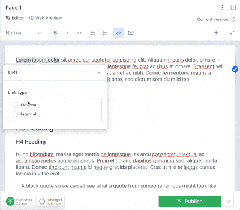

SANITY.io has just released [conditional fields](https://www.sanity.io/docs/conditional-fields) for their content studio which enables developer superpowers to fine tune the editing experience in ways that just weren't possible before.

You can now conditionally hide and show fields in the editor based on content in other fields.

> Heyo! This post assumes you are already a bit familiar with SANITY and their concept of schemas. If you are brand new to SANITY you might want to take a [spin through their crash course](https://www.sanity.io/docs/getting-started) and come back here.

Dealing more explicitly with the problem of internal (relative) and external (url) links immediately came to mind for me as an ideal use case for learning conditional fields.

Previously it was possible to allow relative links in SANITY's [url schema type](https://www.sanity.io/docs/url-type) which works great if you have a savvy developer inputting data, but leaves a lot of room for error if the user is less familiar with urls and how they work. But now with conditional fields you can explicitly ask the user what kind of link they need and show them different inputs based on their selection.



Check it out! Here is what the link schema I came up with looks like. Note the `hidden` fields which control when inputs are hidden or visible. Imagine these like boolean if statements, `hidden: true` and `hidden: false` with the true and false values being determined based on the results of the inline function call.

```js
export default {
  name: "link",
  title: "Link",
  type: "object",
  fields: [
    {
      title: "Select the type of link",
      description:
        "External links go to other websites using the format `https://www.google.com`. Internal links are restricted to other pages in the SANITY database.",
      name: "linkType",
      type: "string",
      options: {
        list: [
          { title: "External", value: "external" },
          { title: "Internal", value: "internal" },
        ],
        layout: "radio",
      },
    },
    {
      title: "URL",
      name: "href",
      type: "url",
      hidden: ({ parent }) => parent?.linkType !== "external", // hidden if link type is not external
      validation: (Rule) =>
        Rule.uri({
          allowRelative: true,
          scheme: ["https", "http", "mailto", "tel"],
        }),
    },
    {
      title: "Open in new tab?",
      name: "blank",
      description: "Read https://css-tricks.com/use-target_blank/",
      type: "boolean",
      hidden: ({ parent }) => parent?.linkType !== "external", // hidden if link type is not external
    },
    {
      name: "internalLink",
      type: "reference",
      title: "Internal Link",
      hidden: ({ parent }) => parent?.linkType !== "internal", // hidden if link type is not internal
      to: [
        { type: "post" },
        { type: "page" },
        // other types you may want to link to
      ],
    },
  ],
}
```

When entering a link the content editor is first presented with a choice; internal or external. And then based on that selection it either shows them a url entry field or a reference entry field. The url field is pretty standard fair - enter any valid web address. The internalLink field is where it gets cool; the content editor selects a reference to an actual page in the database to be the link. This prevents there from ever being dead links or typos! And remember that SANITY won't let you delete pages that have a reference to them - no accidentally deleting pages and breaking links either!

So this is great - but now we need to render that content correctly from the backend into our frontend. This next bit is biased towards React, however likely applies to other popular frontend frameworks with some tweaks.

With the schema above you will get back data that looks like this.

```json
{
  "linkType": "internal", // could be 'external'
  "href": "https://www.google.com",
  "blank": false,
  "internalLink": {
    "id": "-7625244c-859f-5967-818d-63d741d1d36c",
    "slug": {
      "current": "fish-are-the-best-pets-ever"
    }
  }
}
```

You can then build a custom component that takes in this data and conditionally renders either a Link component for client side routing or a standard anchor tag for external links.

Here is an example from Gatsby.

```jsx
import React from "react"
import { Link } from "gatsby"

const SanityLink = ({ children, link, ...props }) => {
  const internalSanityLink = link?.linkType === "internal"
  const externalSanityLink = link?.linkType === "external"

  if (internalSanityLink) {
    return (
      <Link to={link.internalLink.slug.current} {...props}>
        {children}
      </Link>
    )
  }
  if (externalSanityLink) {
    return (
      <a href={link.href} target={link.blank ? `_blank` : null} {...props}>
        {children}
      </a>
    )
  }
}

export default SanityLink
```

The other frontend hurdle with these links is creating an appropriate serializer for [presenting portable text](https://www.sanity.io/docs/presenting-block-text) (what SANITY calls its formatted text content). In portable text data is stored in arrays of 'block content' that are identified with specific marks and types. For example if you entered bolded text it would be stored with a bold mark. In this case our links are stored with a link mark. These marks and types allow you to programmatically control how the raw portable text is rendered back to the frontend.

Here is an example for the link. In this example I'm conditionally handling a few different variations on the link data with early returns and then finally dumping into an href tag as the final return statement.

```js
// serializer.js
// other serialzers...
link: ({ children, mark }) => {
      if (mark.linkType === "internal" && mark.internalLink._type === "post") {
        return (
          <Link to={`/blog/${mark.internalLink.slug.current}`}>
            {children}
          </Link>
        )
      }
      if (mark.linkType === "internal") {
        return (
          <Link as={Link} to={`/${mark.internalLink.slug.current}`}>
            {children}
          </Link>
        )
      }
      if (mark.linkType === "external" && mark.blank) {
        return (
          <a href={mark.href} target="_blank">
            {children}
          </a>
        )
      }
      if (mark.linkType === "external") {
        return <a href={mark.href}>{children}</a>
      }
    },
```

You can read more about setting up serializers in my blog post on [using Theme-UI with SANITY and Gatsby](/writing/using-theme-ui-with-sanity/).

So there you have it! Conditional fields for the win! This open up lots of new possibilities to customize and enhance the content editing experience for everyone. How are you using (or planning to use) conditional fields in your content model? Do you have some ideas and suggestions for how these conditional links could be improved on? I would love to hear about it!

Happy coding!
